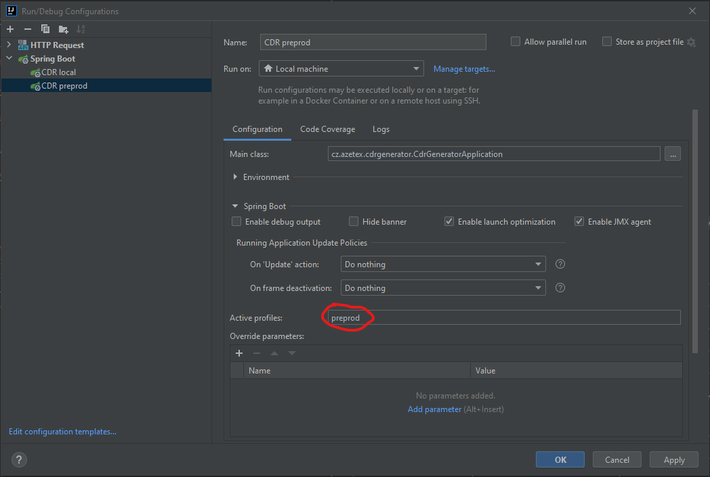

# CDR generátor java

## Jak rozjet aplikaci
### 1. DB
1. MySQL (třeba xammp)
2. vytvořit DB (např. cdr_preprod)
3. importovat (spustit) script `src/main/resources/backup/db/cdr_backup_20211211.sql`
4. vytvořit uživatele se základními právy CRUD - jméno `cdr_preprod_user`, heslo `password` (pokud je jiné, je potřeba opravit v `application-preprod.yml`)

### 2. Aplikace
Dělal jsem to na JDK 11 (možná bude fungovat i JDK 1.8)
1. naklonovat si projekt z gitu k sobě 
2. spustit maven `clean` a `install`
3. spustit pod profilem `preprod`

### 3. Postman
* Kolekce requestů je v `src/main/resources/backup/postman/cdr-generator-20211211.postman_collection`, stačí importovat

### Jak formátovat proměnné
| proměnná                  | délka / formát                   | poznámka                              |
| ---                       | ---                              | ---                                   |
| ${msisdn}                 | 12                               |                                       |
| ${imsi}                   | 15                               |                                       |
| ${timestamp}              | YYYYMMDDhhmmss                   |                                       |
| ${data_units}             | 20 cifer, 10 download, 10 upload   začátek vpravo   např. "00000005120000000512" pro 1024kB | simulovanou usage rozdělit na 2 části |
| ${data_units_unformated}  | číslo                            | pouze prepaid data                    |
| ${voice_units}            | číslo                            |                                       |
| ${formated_voice_units}   | 6 cifer max, začátek zleva, poté mezery   např. "60&nbsp;&nbsp;&nbsp;&nbsp;", "123456" | |

### Poznámky k API
* Chyby se dají vracet i v češtině. HTTP Header -> Accept-Language = "cs"
* Vyhledávat se dá podle parametrů níže. Výsledná množina výsledků jsou výsledky co odpovídají všem podmínkám

    | parametr         | hodnota |
    | ---              | --- |
    | operatorTypeName | název operátora   |
    | dataTypeName     | název typu dat    |
    | chargingClass    | = první dvě cifry |
    | chargingCode     | = zbylé cifry     |
    | isUsed           | true / false      |
